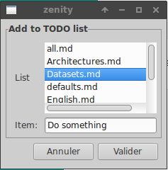
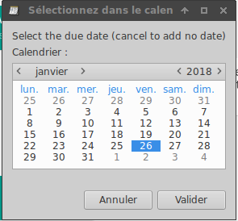

These are scripts intended to manage a todolist.
The overall idea is to write various notes in markdown files in a dedicated folder, then have a script gather all todo items in the notes.

# Setup

* Have a dedicated folder with markdown notes.
* Fill out the config file with the path to that folder, and the path and name of the todo list (scripts assume it is called TODO.md and if it is in the same folder).
* In the notes, start a todo item anywhere by writing "[TODO]". The rest of the line is the todo item.
* TODO items can have due dates, written @date(dd/mm/yyyy) (French dates).

Example:

     # [TODO] Do a repository with the todo scripts @date(27/01/2018)

# Usage

The python3 script `gather_todo.py` parses all markdown files in the folder and organises todo items by due date and category, then writes the todo list to the specified file.

The script `add_todo.sh` is a graphical interface for adding todo items as titles in any files of the todo folder:

The script `show_todo.sh` shows a preview of the todolist in a popup.

I use launchers in xfce4 panel for `show_todo.sh` and `add_todo.sh`.
